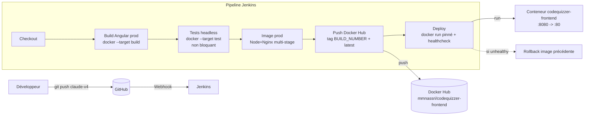

# CI/CD — CodeQuizzer Frontend

Pipeline **Jenkins + Docker** : à chaque `push` sur `claude-v4`, l'application
Angular est buildée, testée, packagée en image Docker (Node + Nginx), poussée
sur Docker Hub puis déployée — avec **rollback** automatique en cas d'échec.

---

## 1. Architecture du pipeline



**Pourquoi tout dans Docker ?** L'agent Jenkins n'a besoin que de **Docker + Git**.
`npm ci` / `ng build` / les tests tournent à l'intérieur d'images → reproductible,
identique sur Windows aujourd'hui et sur Linux/Kubernetes demain.

---

## 2. Structure des fichiers

```
codeQuizzer-frontend/
├── Dockerfile            # Multi-stage : build (Node) → test → runtime (Nginx)
├── nginx.conf            # Service SPA : fallback index.html, cache, gzip, /healthz
├── .dockerignore         # Contexte de build minimal (pas de node_modules/.git…)
├── Jenkinsfile           # Pipeline déclaratif complet (ce dépôt)
├── karma.conf.js         # Tests : Chrome en local, ChromeHeadlessNoSandbox en CI
├── angular.json          # outputPath=dist/codeQuizzer (→ dist/codeQuizzer/browser)
├── CICD.md               # Ce document
└── src/ …                # Application Angular
```

---

## 3. Prérequis Jenkins

**Plugins** : Pipeline, Git, GitHub, Credentials Binding, Timestamper, Docker Pipeline (recommandé).

**Agent** (`agent any`) : doit avoir `git` et `docker` dans le `PATH`, et l'accès au
démon Docker (Docker Desktop sous Windows ; socket `/var/run/docker.sock` sous Linux).

**Job** : un *Pipeline* nommé `codeQuizzer_frontend`
- Définition : **Pipeline script from SCM** → Git → URL du repo → branche `*/claude-v4`
  → *Script Path* = `Jenkinsfile`.
- Cocher **GitHub hook trigger for GITScm polling** (le webhook est déjà en place).

> ⚠️ **Nom d'image Docker en minuscules obligatoire.** Docker Hub refuse les
> majuscules : on utilise `mmnassri/codequizzer-frontend` (et non
> `codeQuizzer-frontend`). Le dépôt GitHub, lui, garde sa casse.

---

## 4. Jenkins Credentials (aucun secret en clair)

Créer **Manage Jenkins → Credentials → System → Global → Add Credentials** :

| Champ | Valeur |
|------|--------|
| Kind | **Username with password** |
| Username | `mmnassri` (login Docker Hub) |
| Password | *un **Access Token** Docker Hub* (Account Settings → Security → New Access Token) |
| ID | `dockerhub_cred` |

Le `Jenkinsfile` y accède via `withCredentials([...])` et se connecte avec
`--password-stdin` : **le secret n'apparaît jamais** dans les logs ni en argument.

> 🔐 Préférez un **token Docker Hub** au mot de passe du compte (révocable,
> périmètre limité). Idem si vous ajoutez un repo Git privé : créez un credential
> Git séparé et référencez-le dans l'étape `git`.

---

## 5. Variables d'environnement (bloc `environment` du Jenkinsfile)

| Variable | Défaut | Rôle |
|---------|--------|------|
| `IMAGE` | `mmnassri/codequizzer-frontend` | Nom de l'image (minuscules) |
| `CONTAINER_NAME` | `codequizzer-frontend` | Nom du conteneur déployé |
| `DOCKER_NETWORK` | `codequizzer-net` | Réseau Docker (prêt pour un backend) |
| `HOST_PORT` | `8080` | Port publié sur l'hôte (`HOST:CONTAINER`) |
| `CONTAINER_PORT` | `80` | Port Nginx interne |
| `DEPLOY_BRANCH` | `claude-v4` | Branche déployée |
| `DOCKERHUB_CRED` | `dockerhub_cred` | ID du credential Jenkins |

> Pour viser un autre port public, changez `HOST_PORT`. Pour gérer
> dev/staging/prod, dérivez `IMAGE`/`HOST_PORT`/`CONTAINER_NAME` de `BRANCH_NAME`.

### Configuration applicative (API / Keycloak)
`src/environments/environment.ts` (prod) contient des **URLs placeholder**
(`api.example.com`, `auth.example.com`) **figées au build**. Avant un vrai
déploiement, renseignez-y les vraies URLs **ou** adoptez la config *runtime*
(voir §8) pour pouvoir promouvoir la **même image** entre environnements.

---

## 6. Versioning des images

Chaque build produit **deux tags** :

- **`mmnassri/codequizzer-frontend:<BUILD_NUMBER>`** — immuable, traçable, c'est
  **ce tag qui est déployé** (déploiement déterministe & rollback fiable).
- **`mmnassri/codequizzer-frontend:latest`** — pointeur « dernière version ».

> Évolution conseillée : ajouter un tag **`:<git-sha>`** (déjà calculé dans
> `env.GIT_SHA`) voire du **SemVer** sur tag Git (`v1.2.3`) pour les releases.
> Ne déployez **jamais** `latest` en prod (ambigu) — toujours un tag immuable.

---

## 7. Stratégie de rollback

1. Avant déploiement, le pipeline lit l'image du conteneur en service
   (`docker inspect … {{.Config.Image}}`) → `PREVIOUS_IMAGE`.
2. Le nouveau conteneur démarre **pinné sur `:<BUILD_NUMBER>`**.
3. `waitHealthy()` attend l'état **`healthy`** (sonde `HEALTHCHECK` → `/healthz`).
4. Si le conteneur ne devient pas sain (ou si une étape échoue), `post.failure`
   appelle `rollback()` qui **redéploie `PREVIOUS_IMAGE`**.

Rollback **manuel** possible à tout moment :
```bash
docker rm -f codequizzer-frontend
docker run -d --name codequizzer-frontend --network codequizzer-net \
  --restart unless-stopped -p 8080:80 mmnassri/codequizzer-frontend:<ANCIEN_BUILD_NUMBER>
```

> Limite assumée d'un rollback « de base » : il y a une brève interruption
> (stop → run). Pour du **zéro-downtime**, voir Kubernetes (§8) ou un reverse
> proxy avec bascule blue/green.

---

## 8. Préparation à la migration Kubernetes

Le socle est déjà « K8s-ready » :

- **Image stateless** servie par Nginx, **tags immuables** → parfait pour un
  `Deployment` avec `image: …:<BUILD_NUMBER>`.
- **`/healthz`** → branchez directement `livenessProbe` & `readinessProbe`.
- **Helpers `sh`/`bat`** : le passage sur agent Linux ne demande aucune réécriture.

Étapes de migration :
1. **Config runtime** (au lieu de figer `environment.ts`) : servir un
   `assets/config.json` (ou un `env.js` injecté par un *entrypoint* via
   `envsubst`) chargé au démarrage par un `APP_INITIALIZER`. La **même image**
   est alors promue dev→staging→prod, l'URL d'API venant d'une **ConfigMap**.
2. **Image non-root** : passez à `nginxinc/nginx-unprivileged` (écoute sur 8080)
   pour satisfaire les *Pod Security Standards* (`runAsNonRoot: true`).
3. Manifestes `Deployment` + `Service` + `Ingress` (TLS), `HorizontalPodAutoscaler`.
4. CI : remplacez l'étape *Deploy* `docker run` par
   `kubectl set image deployment/… ` (ou Helm/ArgoCD). Rollback natif :
   `kubectl rollout undo deployment/codequizzer-frontend`.

---

## 9. Recommandations de sécurité

- ✅ **Secrets** : uniquement via Jenkins Credentials + `--password-stdin`
  (rien en clair, rien dans les logs). Utilisez un **token** Docker Hub.
- ✅ **`.dockerignore`** strict : ni `.git`, ni `node_modules`, ni secrets dans
  le contexte/l'image.
- ✅ **Images de base épinglées** (`node:20-alpine`, `nginx:1.27-alpine`) ;
  épinglez par **digest** (`@sha256:…`) pour une reproductibilité totale.
- ✅ **En-têtes de sécurité** Nginx (`X-Frame-Options`, `X-Content-Type-Options`,
  `Referrer-Policy`), `server_tokens off`.
- 🔜 **Scan de vulnérabilités** (Trivy) avant push — étape prête à réactiver :
  ```groovy
  // stage('Scan (Trivy)') {
  //   steps { script {
  //     runCmd "docker run --rm aquasec/trivy:latest image --exit-code 1 " +
  //            "--severity HIGH,CRITICAL ${IMAGE}:${IMAGE_TAG}"
  //   } }
  // }
  ```
- 🔜 **Conteneur non-root** + `--read-only` + `--cap-drop ALL` en prod.
- 🔜 **HTTPS/TLS** via reverse proxy (Traefik/Nginx) ou Ingress K8s.

---

## 10. Tester en local (avant Jenkins)

```bash
# Build de l'image de production
docker build -t mmnassri/codequizzer-frontend:dev .

# Lancer et ouvrir http://localhost:8080
docker run -d --name codequizzer-frontend -p 8080:80 mmnassri/codequizzer-frontend:dev
docker ps                      # STATUS doit passer à "healthy"
curl http://localhost:8080/healthz   # -> ok

# (Optionnel) exécuter les tests unitaires headless comme en CI
docker build --target test -t cq-test .
```
